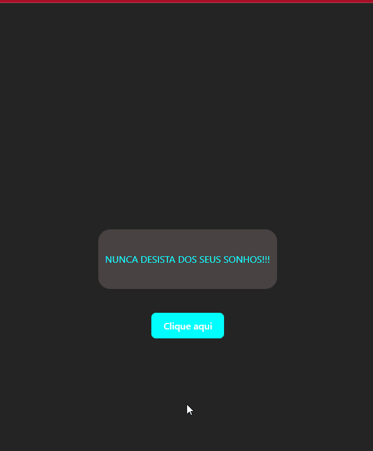

# Quest React Base
Challenge proposed in the DevQuest course - DevEmDobro, in the React base module.

## Desafio 💻
🟣 Create a paragraph
- A component should be created (with a good name).
- This component should render on the screen a colored paragraph with all letters in uppercase, using JavaScript.
- Using props to pass the desired text and text color into the component.

🟣 Create a button
- A Button component should be created with a click event that presents an alert informing the button's label prop that was clicked, with the following message: 'The label of this button is "label here.".'
## Técnologias utilizadas

## Layout
